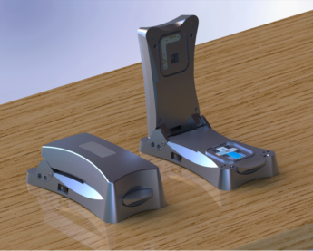

# IO Rodeo Potentiostat Shield (Variant for ECL — under development)



Forked from https://github.com/iorodeo/potentiostat. 

Under development:
  - New version of firmware for modified hardware for electrocheminiluminescence (ECL). Details to be provided...
  - Modification of python software to work with ECL device firmware.
  - CLI and GUI apps to support testing and development of the ECL device


## Installation


The python components are available on the 
`Python Package Index <https://pypi.org/project/eclometer/>`_ and can be
installed using PIP as follows:

```pip install eclometer```


If you plan to contribute to the development, or both use and edit the source code, you should clone the repository, and install it using the following PIP command:


``` 
git clone https://github.com/GVRX/potentiostat.git
pip install -e potentiostat/software/python/potentiostat/
```


Beware: The GUI is based on Gooey that depends on wxPython which does not install reliably across different platforms and package managers (see `Issue <https://github.com/chriskiehl/Gooey/issues/661/>`).  


## Examples


### Serial Interface

The serial inteface is compatible with the IO Rodeostat serial interface on which the ECLometer is based.  The (beta)
version of the ECLometer firmware does not support encoding/docoding of JSON strings so a raw serial mode of communication was implemented.  Compatibility is generally preserved by encoding responses received from the device and decoding them before sending to the device. This mode is unlikely to be supported in future versions of the firmware or the serial interface.

Example usage:

First import the required module:
```
from eclometer.potentiostat import Potentiostat
```

Define dictionary containint test parameters:
```
test_param = {
        'amplitude'  : 2.0,  # V
        'offset'     : 0,    # waveform offset (V)
        'period'     : 10,   # sample period (m/s) — converted to scan rate (V/s) for ECL
        'shift'      : 0,    # waveform phase shift as fraction of wavelength
        'gain'       : 1.0,  # amplification gain for measured current
        'HV'         : 950,  # the voltage applied to the photon detector (PMT)
        'measure'    : 'IP'  # = (IV, IP, PV), where I=current, V=voltage, P=photocurrent
        }
```

Create potentiostat object:
```
dev = Potentiostat(port, 
                   raw=True,     # required for ECL firmware (version 0.x)
                   debug=False   # enable/disable debug mode
                   )     
```

Run test :

```
data = dev.run_test(test_name,   # name of test to run
                    test_param,  
                    display = 'data',      # specify what is displayed during test (data |  plot | pbar)
                    filename = 'data.txt'  # data output path
                    )
```


`data` contains a dictionary containing time (t), current (i), voltage, (v), and photocurrent (p) values. 

```
import eclometer.plots as plots 
plots.plotData(data, smooth = 10)
```


### Utilities for testing

See examples/*.py

### Command Line Interface (CLI)

After installing the python components using PIP as described above, you can run the command line interface with the command:

```
python -m eclometer.interfaces.runECL
```

Alternatively, you can add the path where eclometer was installed to the PYTHONPATH environment variable and use the command:

```
python runECL.py
```

You can even make runECL.py executable and add the path <ecl installation path>/interfaces to the PATH environment variable and use the command:

```runECL.py```

For help on using input parameter files and arguments that control the device, experiment and output optoins, use the command:

```
runECL.py --help
```

All parameters can be set from parameter file (-F flag), individual CLI arguments, or both.  CLI arguments override parameters loaded from file. Examples:

The command:

        ```runECL.py -F immunoAssay1.json --plot --smooth 20```

will run the experiment defined in immunoAssay1.json, plot the data and smooth it with a smoothing width of 20 samples.

The command:

        ```runECL.py -F immunoAssay1.json --HV 1100```

will run the experiment defined in immunoAssay1.json with the PMT HV voltage at 1100 V, overriding the HV value in immunoAssay1.json
    


### Graphical User Interface (GUI)

The GUI can be run using:

```python eclometer.interfaces.guiECL```

or, with the same path considerations as for runECL.py, simply:

'''guiECL.py```

On some platforms you may need to use `pythonw` instead of `python`.


### Configuration Files for CLI and GUI Interfaces

#### Default Configuration File:

Device and test default parameters stored in defaults.json are loaded by the GUI and CLI programs.

It is recommended that you change the value of `port` in defaults.ini.

A quasi-JSON format is used.  Comments (python style, starting with #) are allowed.

#### Test Configuration File:

Test configuration files may contain any subset of parameters that appear in defaults.json.  This can be used to specify the configuration of a commonly used test.

A quasi-JSON format is used.  Comments (python style, starting with #) are allowed.


## Hardware

(todo: documentation)

## Installation

(todo: documentation)

## Contributors


- Grant van Riessen

- Darrell Elton

- Conor Hogan 

- Laena Dalton

- Eric Huwald

- Philip Pawlowski


## Acknowledgements

(todo)
